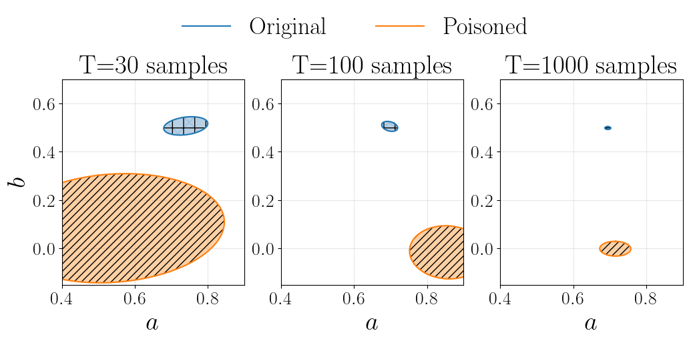
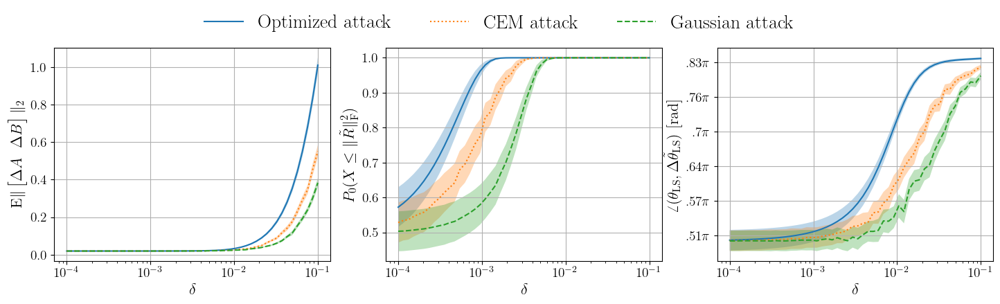
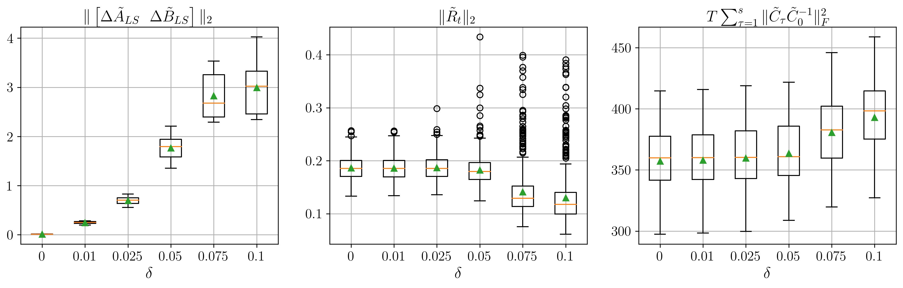

# data-poisoning-linear-systems

Code for the paper [_Analysis and Detectability of Offline Data Poisoning Attacks on Linear Systems_](https://arxiv.org/abs/2211.08804).

*Author*: Alessio Russo (alessior@kth.se)

*License*: MIT

## Requirements

To run the examples you need the following libraries: `numpy scipy cvxpy dccp momentchi2 torch matplotlib`

## Input poisoning attack

To run the example, run the file `main.py` in the folder `example_input_attack`. Feel free to change the standard deviation of the process noise `std_w`, or of the input signal `std_u`.

  

## Residuals maximization attack

To run the example, run the file `main.py` in the folder `example_residuals_maximization`. Use `plot_data.py` to plot the results.

To use the data of the paper, first extract the data from the zipped files `example_residuals_maximization\data\compressed_data.*.zip` in the `data` folder.

  

## Stealthy attack

All the data used in the papers can be found in the folder `example_stealthy_attack\data`.

To plot the data use the `analyse_results.py` file.
To run a new set of simulations use `extract_data.py` to collect the datasets, and `algorithm.py` to compute the poisoning attack using SLSQP.

  

